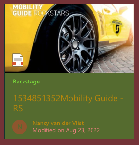
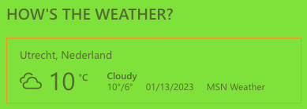
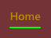
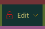
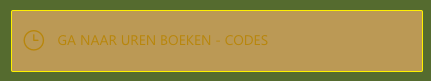
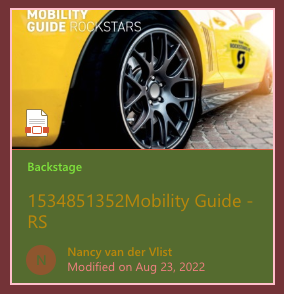
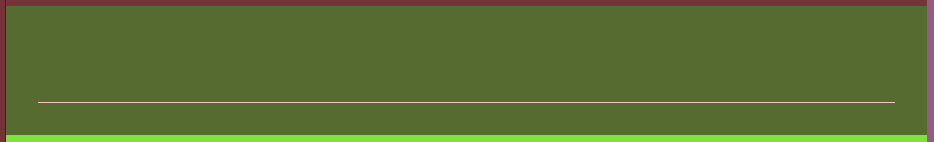

<table>
    <tr>
        <th>theme</th>
        <th>hex</th>
        <th>image</th>
        <th>description</th>
    </tr>
    <tr>
        <td>themePrimary</td><td style="text-align: center;">&nbsp;&nbsp;&nbsp;&nbsp;  #7ee23b</td><td>  </td><td>- The light green icons - Backstage text - Button</td>
    </tr>
    <tr>
        <td>themeLighterAlt</td><td style="text-align: center;">&nbsp;&nbsp;&nbsp;&nbsp;  #99588a</td><td>a</td><td>b</td>
    </tr>
    <tr>
        <td>themeLighter</td><td style="text-align: center;">&nbsp;&nbsp;&nbsp;&nbsp;  #df6d4f</td><td>a</td><td>b</td>
    </tr>
    <tr>
        <td>themeLight</td><td style="text-align: center;">&nbsp;&nbsp;&nbsp;&nbsp;  #8444ff</td><td>a</td><td>b</td>
    </tr>
    <tr>
        <td>themeTertiary</td><td style="text-align: center;">&nbsp;&nbsp;&nbsp;&nbsp;  #f7931a</td><td></td><td>border</td>
    </tr>
    <tr>
        <td>themeSecondary</td><td style="text-align: center;">&nbsp;&nbsp;&nbsp;&nbsp;  #c0d6e4</td><td>a</td><td>b</td>
    </tr>
    <tr>
        <td>themeDarkAlt</td><td style="text-align: center;">&nbsp;&nbsp;&nbsp;&nbsp;  #00ff00</td><td>  </td><td>- The green border - And that barely seeing bright green border 
        - Button hover</td>
    </tr>
    <tr>
        <td>themeDark</td><td style="text-align: center;">&nbsp;&nbsp;&nbsp;&nbsp;  #c1141a</td><td></td><td>Active state</td>
    </tr>
    <tr>
        <td>themeDarker</td><td style="text-align: center;">&nbsp;&nbsp;&nbsp;&nbsp;  #fff000</td><td></td><td>border color</td>
    </tr>
    <tr>
        <td>neutralLighterAlt</td><td style="text-align: center;">&nbsp;&nbsp;&nbsp;&nbsp;  #bb9955</td><td></td><td>background color</td>
    </tr>
    <tr>
        <td>neutralLighter</td><td style="text-align: center;">&nbsp;&nbsp;&nbsp;&nbsp;  #733337</td><td></td><td>The reddish background</td>
    </tr>
    <tr>
        <td colspan="4">Note that this is a color that is spreaded over the page the background color for the navigation in this case</td>
    </tr>
    <tr>
        <td>neutralLight</td><td style="text-align: center;">&nbsp;&nbsp;&nbsp;&nbsp;  #133331</td><td> </td><td>- Border around - Background color</td>
    </tr>
    <tr>
        <td>neutralQuaternaryAlt</td><td style="text-align: center;">&nbsp;&nbsp;&nbsp;&nbsp;  #90ee90</td><td>a</td><td>b</td>
    </tr>
    <tr>
        <td>neutralQuaternary</td><td style="text-align: center;">&nbsp;&nbsp;&nbsp;&nbsp;  #8b0000</td><td>a</td><td>b</td>
    </tr>
    <tr>
        <td>neutralTertiaryAlt</td><td style="text-align: center;">&nbsp;&nbsp;&nbsp;&nbsp;  #ffc0cb</td><td> </td><td>- Hover - Line</td>
    </tr>
    <tr>
        <td>neutralTertiary</td><td style="text-align: center;">&nbsp;&nbsp;&nbsp;&nbsp;  #ff8c00</td><td>a</td><td>b</td>
    </tr>
    <tr>
        <td>neutralSecondaryAlt</td><td style="text-align: center;">&nbsp;&nbsp;&nbsp;&nbsp;  #9acd32</td><td>a</td><td>b</td>
    </tr>
    <tr>
        <td>neutralSecondary</td><td style="text-align: center;">&nbsp;&nbsp;&nbsp;&nbsp;  #f08080</td><td> </td><td>Modified text Icon color</td>
    </tr>
    <tr>
        <td>neutralPrimaryAlt</td><td style="text-align: center;">&nbsp;&nbsp;&nbsp;&nbsp;  #008b8b</td><td>a</td><td>b</td>
    </tr>
    <tr>
        <td>neutralPrimary</td><td style="text-align: center;">&nbsp;&nbsp;&nbsp;&nbsp;  #b8860b</td><td>  </td><td>The orange text</td>
    </tr>
    <tr>
        <td>neutralDark</td><td style="text-align: center;">&nbsp;&nbsp;&nbsp;&nbsp;  #bdb76b</td><td></td><td>Active state text</td>
    </tr>
    <tr>
        <td>black</td><td style="text-align: center;">&nbsp;&nbsp;&nbsp;&nbsp;  #8b008b</td><td></td><td>Heading text</td>
    </tr>
    <tr>
        <td>white</td><td style="text-align: center;">&nbsp;&nbsp;&nbsp;&nbsp;  #556b2f</td><td></td><td>Block color</td>
    </tr>
    <tr>
        <td>primaryBackground</td><td style="text-align: center;">&nbsp;&nbsp;&nbsp;&nbsp;  #9932cc</td><td>a</td><td>b</td>
    </tr>
    <tr>
        <td>primaryText</td><td style="text-align: center;">&nbsp;&nbsp;&nbsp;&nbsp;  #e9967a</td><td>a</td><td>b</td>
    </tr>
    <tr>
        <td>error</td><td style="text-align: center;">&nbsp;&nbsp;&nbsp;&nbsp;  #8fbc8f</td><td>a</td><td>b</td>
    </tr>
    <tr>
        <td>accent</td><td style="text-align: center;">&nbsp;&nbsp;&nbsp;&nbsp;  #483d8b</td><td>a</td><td>b</td>
    </tr>
    <tr>
        <td>bodyBackground</td><td style="text-align: center;">&nbsp;&nbsp;&nbsp;&nbsp;  #2f4f4f</td><td>a</td><td>b</td>
    </tr>
    <tr>
        <td>bodyText</td><td style="text-align: center;">&nbsp;&nbsp;&nbsp;&nbsp;  #00ced1</td><td>a</td><td>b</td>
    </tr>
    <tr>
        <td>disabledBackground</td><td style="text-align: center;">&nbsp;&nbsp;&nbsp;&nbsp;  #8a2be2</td><td>a</td><td>b</td>
    </tr>
    <tr>
        <td>disabledText</td><td style="text-align: center;">&nbsp;&nbsp;&nbsp;&nbsp;  #663399</td><td>a</td><td>b</td>
    </tr>
</table>​
